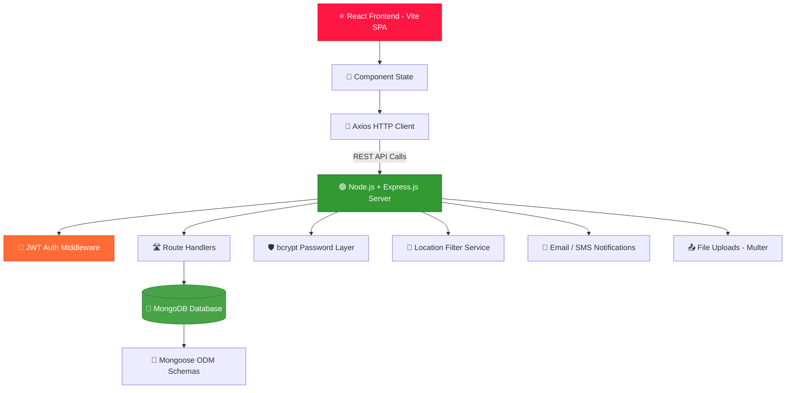

<div align="center">

<!-- Animated Top Banner -->


<!-- Animated Typing SVG -->

<br/>

<!-- Tech Badges -->


<br/><br/>


<br/><br/>


</div>

---

<div align="center">

</div>

## 🚨 Why Red Cross Connect?

<div align="center">

```
🩸  Every 2 seconds, someone in the world needs blood.
🏥  Every day, 40,000+ units of blood are needed.
⏳  Delayed response costs lives.
💡  Red Cross Connect solves this — instantly.
```

</div>

---

<div align="center">

</div>

## 📌 About The Project

> **Red Cross Connect** is a full-stack emergency blood donor platform that bridges the critical gap between blood donors and recipients using **location-based real-time search**.

<table>
<tr>
<td width="50%">

### 🔴 The Problem
- 🚑 Finding blood donors in emergencies is **slow & chaotic**
- 📞 No centralized, reliable donor database
- ⏳ Delayed response = **loss of precious lives**
- 🌍 Geographical mismatch between donors & recipients

</td>
<td width="50%">

### ✅ Our Solution
- ⚡ **Instant** location-based donor discovery
- 🔍 Filter by **blood group + city/location**
- 📲 **One-click** call or notification to donors
- 🌐 Real-time, scalable donor network

</td>
</tr>
</table>

---

<div align="center">

</div>

## 🏗️ System Architecture



---

<div align="center">

</div>

## ✨ Features

<div align="center">

| 🔥 Feature | 📝 Description |
|:---:|:---|
| 🩸 **Donor Registration** | Register as a blood donor with profile, blood group & location |
| 🔍 **Smart Search** | Find donors by blood group, city, or area instantly |
| 📞 **Instant Connect** | Call or message a donor with a single click |
| 🔐 **JWT Authentication** | Secure login/signup with token-based sessions |
| 🛡️ **Password Security** | Credentials hashed with bcrypt.js |
| 📍 **Location-Based Filter** | Find the nearest available donors in your area |
| 📊 **Donor Dashboard** | Manage availability, profile, and donation records |
| 🔔 **Notifications** | Email/SMS alerts for urgent blood requests |
| 📱 **Responsive UI** | Fully optimized for mobile & desktop |
| ☁️ **File Uploads** | Profile picture & document upload support |

</div>

---

<div align="center">

</div>

## 🛠️ Tech Stack

<div align="center">

### 🎨 Frontend


### ⚙️ Backend


### 🔐 Security & Auth
> **JWT** (JSON Web Tokens) · **bcrypt.js** · **Middleware-protected Routes**

### 🚀 Tools & DevOps


</div>

---

<div align="center">

</div>

## 📂 Project Structure

<table>
<tr>
<td width="50%">

### 🔹 Frontend
```
RedCrossConnectFrontEnd/
 ├── 📁 src/
 │    ├── 🧩 components/
 │    ├── 📄 pages/
 │    ├── ⚙️ services/
 │    └── 🎨 assets/
 ├── 📄 index.html
 ├── 📦 package.json
 ├── 📦 package-lock.json
 ├── ⚡ vite.config.js
 └── 🚫 .gitignore
```

</td>
<td width="50%">

### 🔸 Backend
```
RedCrossConnectBackend/
 ├── 🎮 controllers/
 │    ├── authController.js
 │    └── donorController.js
 ├── 🛡️ middlewares/
 │    └── authMiddleware.js
 ├── 📦 models/
 │    ├── User.js
 │    └── Donor.js
 ├── 🛣️ routes/
 │    ├── authRoutes.js
 │    └── donorRoutes.js
 ├── 📤 uploads/
 ├── 🔑 .env
 ├── 🚀 index.js
 ├── 📦 package.json
 └── 📦 package-lock.json
```

</td>
</tr>
</table>

---

<div align="center">

</div>

## ⚙️ Installation & Setup

### ✅ Prerequisites
```bash
Node.js  >= 16.x
MongoDB  >= 5.x  (local or MongoDB Atlas)
npm      >= 8.x
```

### 1️⃣ Clone & Run Frontend
```bash
git clone https://github.com/Saikaranam-70/RedCrossConnectFrontEnd.git
cd RedCrossConnectFrontEnd
npm install
npm run dev
```

### 2️⃣ Clone & Run Backend
```bash
git clone https://github.com/Saikaranam-70/RedCrossConnectBackend.git
cd RedCrossConnectBackend
npm install
node index.js
```

---

<div align="center">

</div>

## 🔑 Environment Variables

### Backend — `.env`
```env
# Server
PORT=5000

# MongoDB
MONGO_URI=mongodb://localhost:27017/redcross_connect
# OR Atlas:
# MONGO_URI=mongodb+srv://<user>:<pass>@cluster.mongodb.net/redcross_connect

# JWT
JWT_SECRET=your_super_secret_key
JWT_EXPIRES_IN=7d

# Email (Nodemailer / EmailJS - Optional)
EMAIL_USER=your_email@gmail.com
EMAIL_PASS=your_app_password

# Twilio SMS (Optional)
TWILIO_ACCOUNT_SID=your_account_sid
TWILIO_AUTH_TOKEN=your_auth_token
TWILIO_PHONE=+1234567890
```

### Frontend — `.env`
```env
VITE_API_BASE_URL=http://localhost:5000/api
```

---
<!--
<div align="center">

</div>

## 🔗 API Endpoints

<div align="center">

| Method | Endpoint | Auth | Description |
|:---:|:---|:---:|:---|
| `POST` | `/api/auth/register` | ❌ | 🆕 Register as donor or recipient |
| `POST` | `/api/auth/login` | ❌ | 🔐 Login & receive JWT token |
| `GET` | `/api/donors/search` | ✅ | 🔍 Search donors by blood group + city |
| `GET` | `/api/donors/:id` | ✅ | 👤 Get specific donor profile |
| `PUT` | `/api/donors/availability` | ✅ | 🔄 Toggle donor availability status |
| `POST` | `/api/request/notify` | ✅ | 🔔 Send urgent blood request notification |
| `POST` | `/api/upload` | ✅ | 📤 Upload profile picture |

</div>

--->

<div align="center">

</div>

## 🍃 MongoDB Schema Overview

```javascript
// Donor / User Schema (Mongoose)
{
  name:        String,    // Full name
  email:       String,    // Unique email
  password:    String,    // bcrypt hashed
  bloodGroup:  String,    // A+, B+, O-, AB+, etc.
  phone:       String,    // Contact number
  city:        String,    // Location for filtering
  isAvailable: Boolean,   // Donor availability toggle
  profilePic:  String,    // Uploaded image path (uploads/)
  createdAt:   Date       // Auto timestamp
}
```

---

<div align="center">

</div>

## 🎯 Future Enhancements

```
📱  React Native Mobile App (Android & iOS)
🗺️  Google Maps Integration for live donor map
🏥  Hospital & Blood Bank Portal
📊  Analytics Dashboard — blood demand heatmap
🤖  AI-based Smart Donor Matching Algorithm
🔔  Firebase Push Notifications
☁️  Cloud Deployment — Render / Railway / AWS
🩺  Donation History & Health Records Tracker
```

---

<div align="center">

</div>

## 📊 GitHub Stats

<div align="center">

  
</div>

<div align="center">
  
</div>

---

<div align="center">

</div>

## 🤝 Contributing

Contributions are what make the open source community amazing! 🙌

```bash
1. 🍴  Fork the project
2. 🌿  git checkout -b feature/AmazingFeature
3. 💾  git commit -m 'Add some AmazingFeature'
4. 📤  git push origin feature/AmazingFeature
5. 🔃  Open a Pull Request
```

---

## 👨‍💻 Author

<div align="center">


### **Sai Karanam**
*Full Stack Developer | React · Node.js · MongoDB*

[](https://github.com/Saikaranam-70)
[](https://github.com/Saikaranam-70/RedCrossConnectFrontEnd)
[](https://github.com/Saikaranam-70/RedCrossConnectBackend)

</div>

---

## 🐍 Contribution Graph

<p align="center">
  
</p>


---

<div align="center">

## ⭐ Show Some Love

**If this project inspired you or helped you, please give it a ⭐**

*Every star motivates me to build more life-saving tools 🩸*

<br/>


</div>
